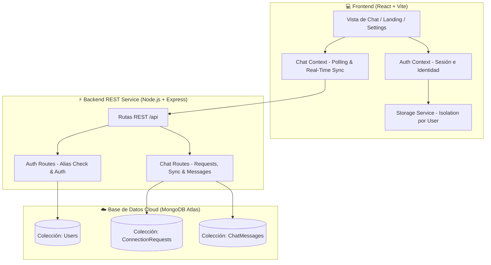

#  Nexu — Mensajería Soberana y Privada en Tiempo Real

[](#)
[](#)
[](#)
[](#)
[](#)

> [!NOTE]
> **Proyecto Final - Master Frontend (DEV.F)**: Nexu es un prototipo completamente funcional de mensajería instantánea enfocado en la **privacidad soberana**, la **comunicación sin spam** y la **sincronización bidireccional en tiempo real** respaldada por MongoDB Atlas en la nube.

---

## 🌟 Filosofía y Propósito de Nexu

En una era donde las aplicaciones convencionales exigen datos personales invasivos como números de teléfono, correos y contactos, **Nexu propone un paradigma de mensajería privada y soberana**:

* **Identidad Irrepetible y Soberana:** Tu identidad es un `@alias` único de 3 a 10 caracteres. No requieres correo electrónico ni número de teléfono para comunicarte.
* **Cero Spam por Diseño:** Nadie puede enviarte mensajes no deseados. La mensajería 1 a 1 solo se desbloquea cuando aceptas una solicitud de conexión.
* **Aislamiento Absoluto de Sesión:** La información y conversaciones de cada usuario están estrictamente aisladas, imposibilitando la fuga o mezcla de datos entre cuentas en un mismo navegador o dispositivo.

---

## 🏗️ Arquitectura del Sistema

Nexu implementa una arquitectura desacoplada y moderna orientada a la mensajería de baja latencia:



### Componentes Clave de la Arquitectura:

1. **Protocolo de Conexiones Anti-Spam:**
   * **Búsqueda en tiempo real:** Verificación de `@alias` en la nube contra MongoDB Atlas.
   * **Flujo del Emisor:** Solicitud en estado *"En espera"*, chat temporalmente bloqueado y opción de *"Cancelar solicitud"*.
   * **Flujo del Receptor:** Trilogía de control con acciones directas para **🟢 Aceptar**, **⚪ Rechazar** o **🔴 Bloquear**.

2. **Motor de Sincronización en Tiempo Real (`syncUserSession`):**
   * Polling bidireccional continuo (< 3s) que detecta la aceptación de conexiones y desbloquea el chat automáticamente sin necesidad de recargar la página.
   * Actualización instantánea del verificador de lectura **Visto (Doble check azul `✓✓`)**.

---

## 🛠️ Tecnologías Utilizadas

### Frontend
*  **React 18**: Biblioteca principal para la interfaz de usuario reactiva y modular.
*  **Vite**: empaquetador de módulos de ultra alta velocidad.
*  **Context API**: Gestión global de autenticación (`AuthContext`) y mensajería en vivo (`ChatContext`).
*  **CSS3 Modular**: Diseño adaptable *Mobile-First*, temas visuales y componentes estilizados.

### Backend & Cloud
*  **Node.js**: Entorno de ejecución en servidor de eventos asíncronos.
*  **Express.js**: Framework para servicios web y endpoints de la API REST.
*  **MongoDB Atlas & Mongoose**: Base de datos en la nube para persistencia de usuarios, conexiones y mensajería.

---

## 👥 Equipo de Desarrolladores y Contribuidores

Agradecimientos especiales al equipo del **Master Frontend (DEV.F)** por su colaboración e innovación:

| Desarrollador / Contribuidor | Rol / Enfoque en el Proyecto | Rama Git |
| :--- | :--- | :--- |
| **Jonathan Medina** ([@jona943](https://github.com/jona943)) | Coordinación, Landing Page, Conexiones & Sync Real-Time | `feature/jonathan` |
| **Rosa Melano** | Login, Autenticación y Registro Minimalista | `feature/rosy` |
| **EmaRama** | Arquitectura de Chat y Mensajería | `feature/EmaRama` |
| **Victor** | Perfil de Usuario y Ajustes de Cuenta | `feature/victor` |
| **Naomi** | Apoyo en Documentación e Interfaz | `feature/naomi` |

---

## 🚀 Instalación y Ejecución Local

### Prerrequisitos
* Node.js (v18.0 o superior)
* npm (v9.0 o superior)

### 1. Clonar el repositorio
```bash
git clone https://github.com/jona943/6.-Proyecto_Final-Master_Frontend.git
cd 6.-Proyecto_Final-Master_Frontend
```

### 2. Iniciar el Backend (Servidor Express)
```bash
cd backend
npm install
npm run dev
```
*El servidor backend iniciará en el puerto `5000` conectado a MongoDB Atlas.*

### 3. Iniciar el Frontend (Aplicación React)
En una nueva terminal:
```bash
cd app-nexu
npm install
npm run dev -- --host
```
*La aplicación cliente iniciará en `http://localhost:5173` y estará lista para probarse en tu computadora o dispositivo móvil conectado a la red local.*

---

<p center="text-align">
  <strong>Nexu</strong> — Mensajería Soberana, Privada y Sin Spam.
</p>
