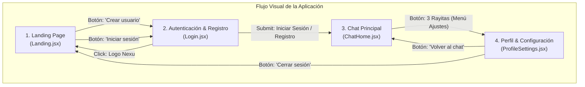

# Flujo de Navegación por Estado (State-Driven Navigation) · Nexu Frontend

Este documento describe la arquitectura y el funcionamiento del flujo de navegación visual unificado implementado en `App.jsx`. Permite conectar e interactuar con todos los módulos del equipo de forma fluida sin requerir backend ni dependencias externas de enrutamiento.

---

## Mapa de Navegación

---

## Arquitectura del Estado en `App.jsx`

El componente raíz `App.jsx` administra la variable de estado `currentView`:

| Valor de `currentView` | Componente Renderizado | Descripción |
| :--- | :--- | :--- |
| `'landing'` | `<Landing />` | Portada inicial, titular, carrusel de ventajas y llamados a la acción. |
| `'login'` | `<Login initialTab="login" />` | Formulario de autenticación en la pestaña de inicio de sesión. |
| `'register'` | `<Login initialTab="register" />` | Formulario de autenticación pre-seleccionado en la pestaña de crear cuenta. |
| `'chat'` | `<ChatHome />` | Interfaz de mensajería directa en tiempo real con historial y contactos. |
| `'settings'` | `<ProfileSettings />` | Panel de perfil de usuario, personalización de tema y ajustes de seguridad. |

---

## Contrato de Props por Componente

### 1. `Landing.jsx`
* **`onNavigate(vista)`**: Función que recibe `'login'` o `'register'` al hacer clic en los botones del Hero.

### 2. `Login.jsx`
* **`initialTab`**: Define qué pestaña se muestra por defecto (`'login'` | `'register'`).
* **`onLoginSuccess()`**: Callback ejecutado al iniciar sesión o crear cuenta para avanzar a `'chat'`.
* **`onNavigateToLanding()`**: Callback ejecutado al hacer clic en el logo superior para regresar a `'landing'`.

### 3. `ChatHome.jsx`
* **`onOpenSettings()`**: Callback activado por el botón de menú hamburguesa (3 rayitas) en la cabecera lateral para abrir `'settings'`.

### 4. `ProfileSettings.jsx`
* **`onBackToChat()`**: Callback para regresar directamente al chat activo (`'chat'`).
* **`onLogout()`**: Callback para cerrar sesión y volver a la portada (`'landing'`).

---

## Ventajas de este Enfoque
1. **Desacoplado y Ligero**: Permite al equipo auditar e iterar sobre el diseño y la experiencia de usuario inmediatamente.
2. **Fácil Transición a React Router**: Cuando el backend esté listo, cada estado se traduce directamente a una ruta (`/`, `/login`, `/chat`, `/settings`).
